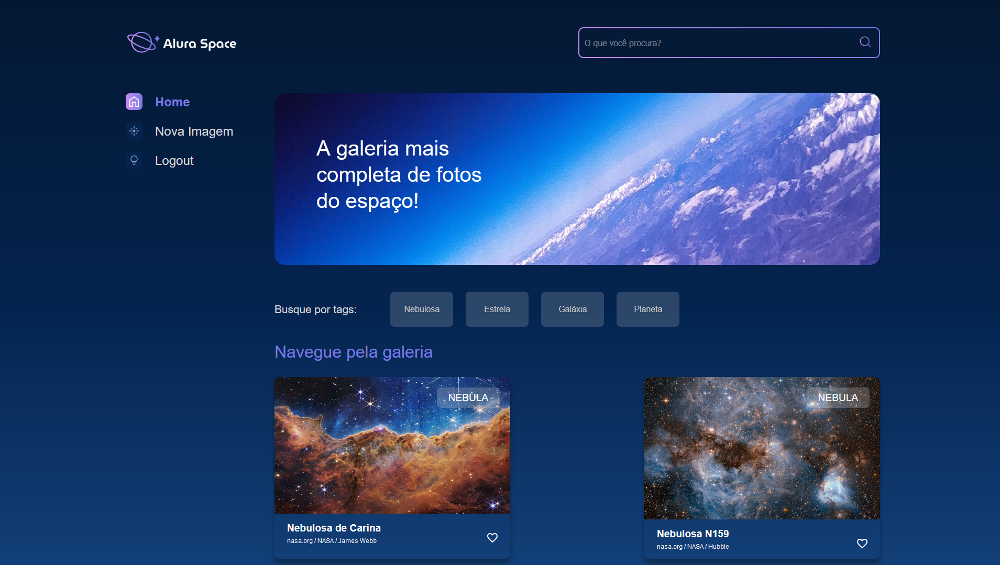

# Introduction

This project is being developed during Alura's "Django: Creating applications using Python" course.



# Running the project

First clone the repository from Github. To clone with ssh, you can use the following command:
```sh
$ git clone git@github.com:PedroLRA/alura_space.git
```

Or, if you prefer to use HTTPS:

```sh
$ git clone https://github.com/PedroLRA/alura_space.git
```    

Then, change to the new directory where the project was cloned:

```sh
$ cd alura_space
```

Install project dependencies:

```sh
$ pip install -r requirements/local.txt
```

Configure the `.env` variable in the `.env.example` file.

To do this, change `<YOUR_SECRET_KEY>` to youy django secret key and remove the `.example` from the file name.

Then simply apply the migrations:

```sh
$ python manage.py migrate
```    

Collect the static files:

```sh
$ python manage.py collectstatic
```

And finally, run the development server:

```sh
$ python manage.py runserver
```

Now the project is already running in your localhost and you can access the app in the following address: http://localhost:8000/.
